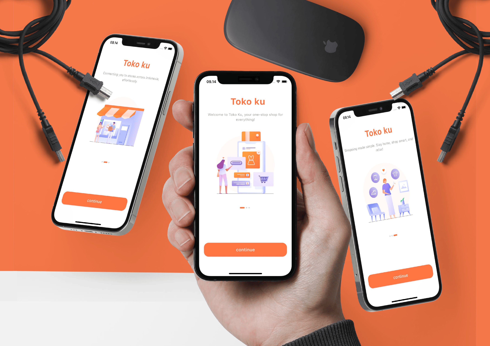
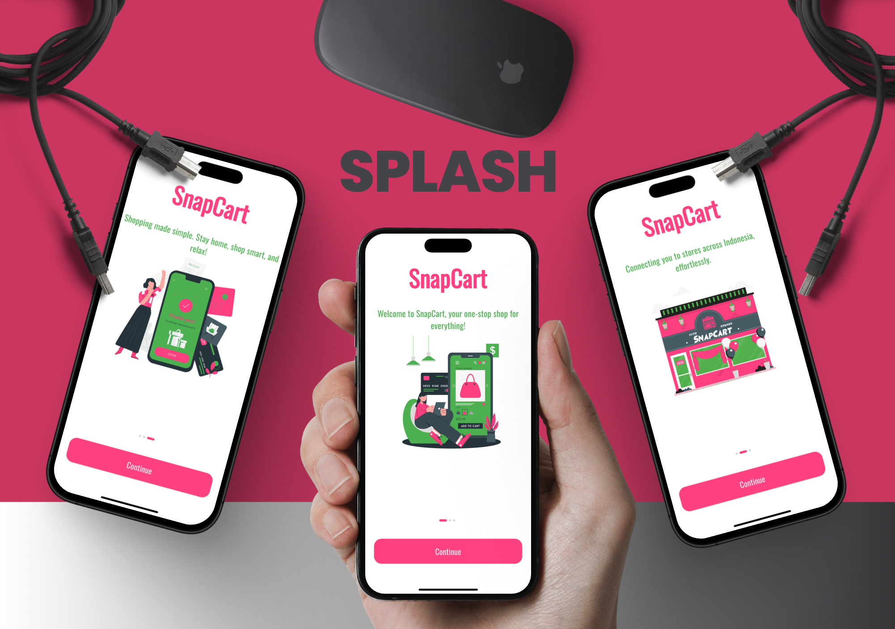
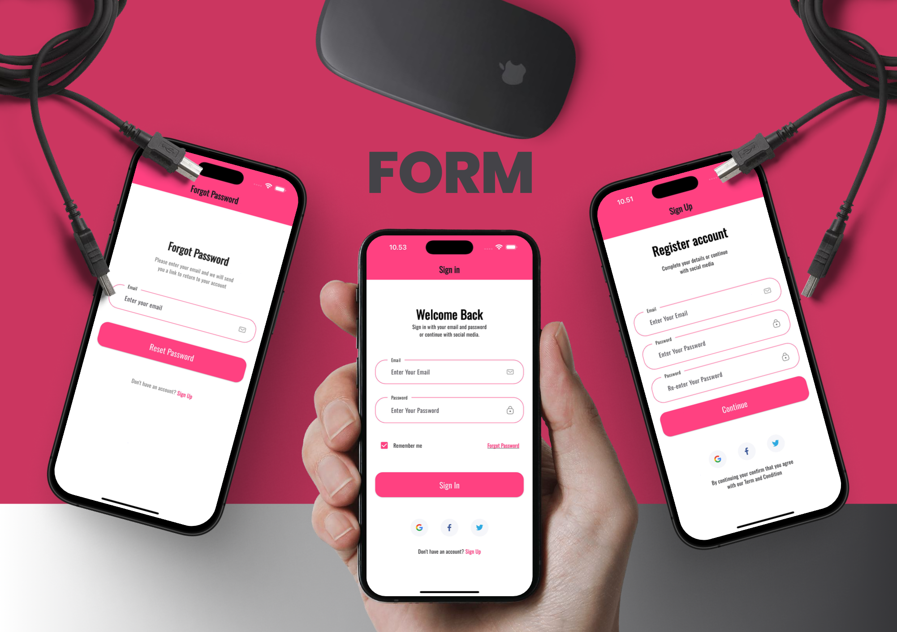

# 🌟 Toko Ku: Your Ultimate Shopping Experience 🛍️

Welcome to *Toko Ku* 🎉, my very first Flutter project! 🚀 Explore the exciting world of e-commerce with this app, where you can browse and shop for a wide range of products. From detailed product information to stunning visuals, *Toko Ku* is designed to enhance your shopping experience. 🛒✨

## 🛒 What's Inside?

**🛍️ Product Info:** Discover comprehensive descriptions of each product, highlighting what makes them unique and valuable.  
**💰 Price & Availability:** Stay updated with current prices and stock levels to make informed purchasing decisions.  
**📸 Visual Appeal:** Enjoy a sleek and modern design with high-resolution images showcasing your favorite products.

## 🎯 Why This App?

Because shopping should be as fun and straightforward as possible! Whether you're a seasoned shopper or new to online buying, *Toko Ku* offers an easy-to-use platform to explore, compare, and purchase items effortlessly. 🛒💫

## 📸 Screenshots

Here’s a sneak peek at what you can expect:

,
 ,
 ,
 ,
 

## 🚀 Features

- **🔍 Search & Filter:** Easily find what you’re looking for with powerful search and filter options.
- **⭐️ Ratings & Reviews:** Check out product ratings and customer reviews to guide your choices.
- **🎁 Special Offers:** Stay tuned for exclusive deals and promotions available only on *Toko Ku*.

## 🛠️ Built With

This app is built using **Flutter**, ensuring a seamless and enjoyable user experience on both iOS and Android platforms. 🖥️📱

## 🎨 Splash Screen

*Toko Ku* features a custom splash screen to make a great first impression. The splash screen sets the tone for a delightful shopping experience right from the start! 🌟✨

---

Feel free to explore the app and let us know if you have any feedback or suggestions. Happy shopping! 🛒💖
